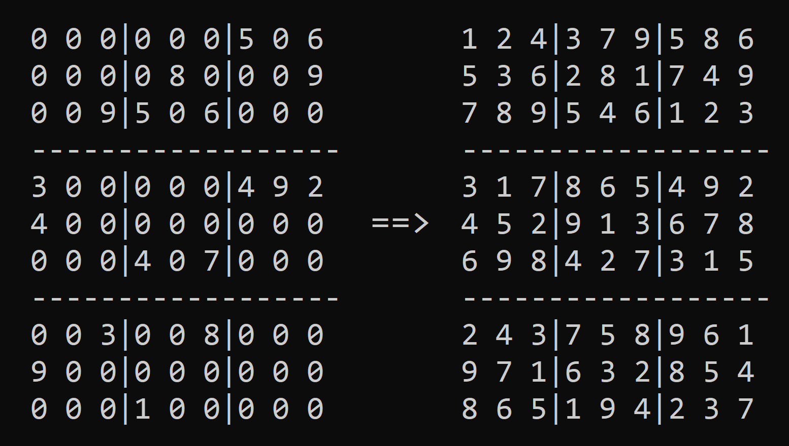

# Sudoku - Generador y solucionador
## Introducción
Este programa genera y soluciona distintas posiciones de un Sudoku con el algoritmo de `Backtracking`.
Sudoku es un juego matemático, diseñado a finales de la década de 1970.

## Reglas
El objetivo del Sudoku es rellenar una cuadrícula de 9x9 celdas (dividida en regiones de 3x3 celdas) con los números del 1 al 9 de manera tal que:
- No hayan números repetidos en una misma fila.
- No hayan números repetidos en una misma columna.
- No hayan números repetidos en una misma región.
  
## Estructura del código
El código se encarga de generar y resolver distintas posiciones de un Sudoku.
- Para resolver una posición, el programa utiliza la técnica de `Backtracking`, la cual consiste en probar distintos estados de la cuadrícula según un conjunto de restricciones (en este caso, las restricciones son las reglas del juego de Sudoku). El algoritmo inserta un número del 1 al 9 en la primera casilla vacía que encuentra, y si ese número es válido para la fila, columna y región, prueba el mismo algoritmo con la siguiente casilla vacía. Si logra completar toda la cuadrícula verificando las reglas, el Sudoku queda resuelto. Si no lo logra, comienza a borrar números previamente introducidos y prueba con otra solución.
- Para generar una posición, el programa ordena de manera aleatoria un vector que contiene los números del 1 al 9. Luego, inserta este vector en una de las primeras tres filas de la cuadrícula. Realiza la misma operación para las siguientes seis filas del Sudoku (de manera que no se repitan números en las columnas) y resuelve la posición. Luego de resolverla, elimina una cierta cantidad de números de la cuadrícula de forma aleatoria.
