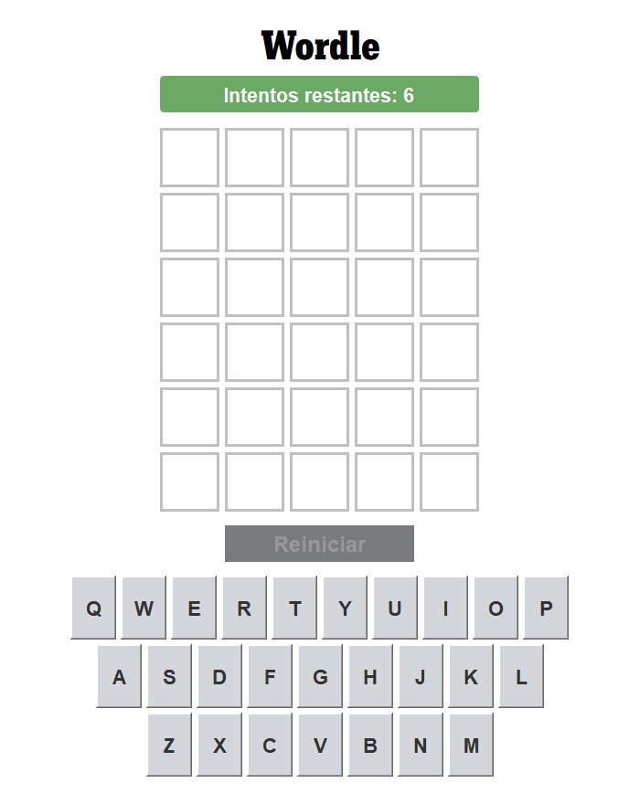

# Wordle - Clon
## Introducción
Wordle ([enlace a la página del juego](https://www.nytimes.com/games/wordle/index.html)) es un juego de adivinanza de navegador, en el cual el jugador debe adivinar la palabra secreta realizando suposiciones. Fue desarrollado por Josh Wardle en 2021.

## Cómo jugar
El jugador tiene seis intentos para adivinar la palabra. Al introducir una suposición, las letras de la palabra cambiarán de color de acuerdo a las siguientes reglas:
- Verde: Si la palabra secreta contiene la letra y además se encuentra en el lugar correcto, la letra cambia de color a verde.
- Amarillo: Si la palabra secreta contiene la letra pero se encuentra en el lugar incorrecto, la letra cambia de color a amarillo.
- Negro: Si la palarba secreta no contiene la letra, esta cambiará de color a negro.

ACLARACIÓN: siguiendo las reglas del juego original, cuando la palabra insertada tenga una letra repetida y esta letra se encuentre en la palabra solo una vez (por ejemplo, armar y vista), se contará una sola de estas letras al cambiar el color a verde/amarillo, ya que solo aparece una vez en la palabra secreta.
  
## Estructura del código
El código se basa en el patrón de arquitectura MVC. 
- Modelo: El modelo se encarga de retornar y cambiar el estado actual de la simulación, así como los datos del tamaño de las celdas, la pantalla, y otros.
- Vista: La vista se encarga de actualizar el estado del modelo una vez que este cambia.
- Controlador: El controlador se encarga de recibir las entradas de usuario y manejarlas para cambiar la simulación. Cuando la simualción debe cambiar, envía un mensaje al modelo para actualizar las celdas, así como un mensaje a la vista para actualizar la interfaz de usuario.

(https://www.diccionariodedudas.com/)

La vista utiliza la biblioteca gráfica Swing para generar la interfaz de usuario.
